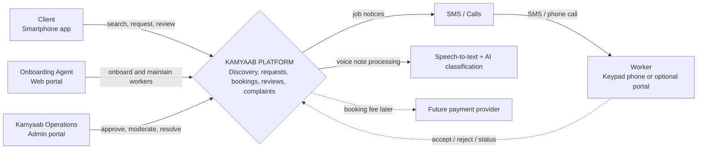
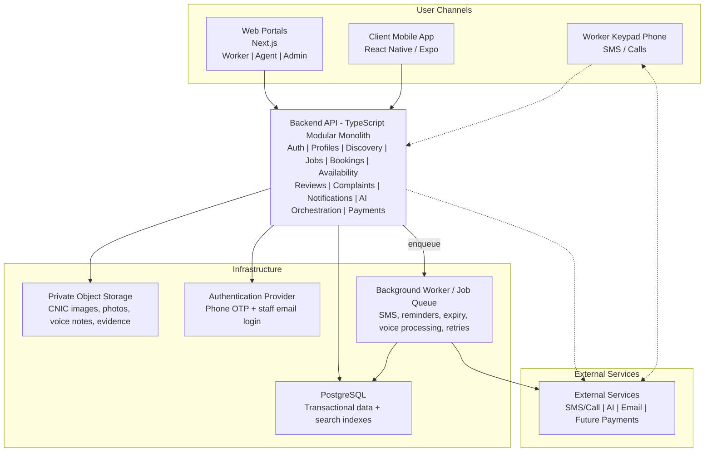
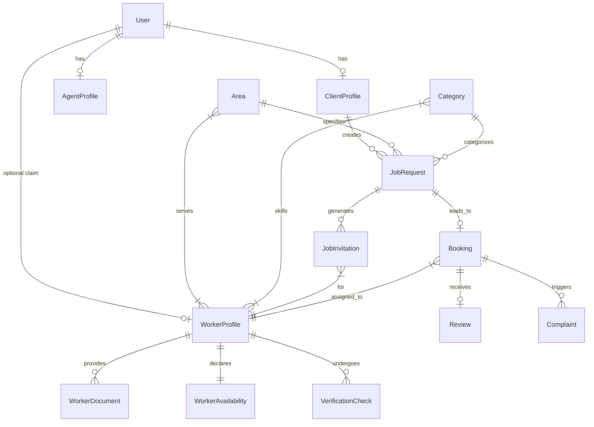
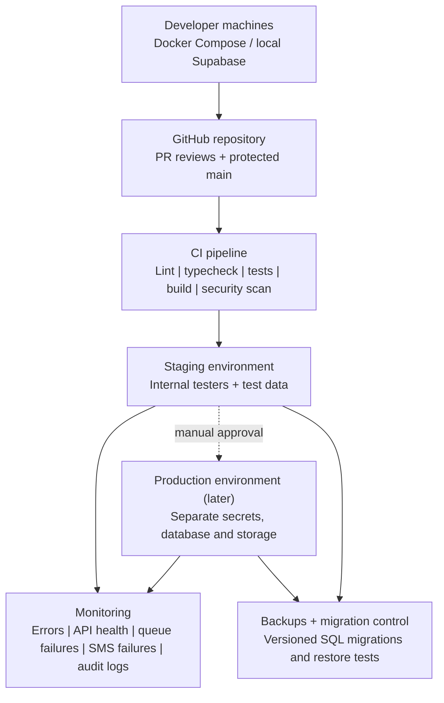

# Kamyaab Platform - Architecture & Implementation Plan

## 1. Executive Summary

Kamyaab is a trust-based job-matching platform connecting verified blue-collar workers (electricians, plumbers, carpenters, etc.) with households and small businesses in Pakistan. Unlike conventional employment portals, Kamyaab acts as a **managed marketplace** serving both smartphone users and those with standard keypad phones. 

Key product features:
- **Client App**: Voice/text job posting with AI smart matching, specific worker search, and a two-way rating system.
- **Worker/Agent Workflow**: Agent-onboarded verification (CNIC + references), job dispatch via SMS/Calls, and an optional worker portal.
- **Backend API**: TypeScript modular monolith handling discovery, requests, bookings, AI orchestration, and notifications.

---

## 2. System Context

The following diagram illustrates the interaction between Kamyaab's users, the core platform, and external systems.

---

## 3. Logical Application Architecture

The platform's technology stack is based on a modern, typed ecosystem to ensure reliability and speed of execution.

- **Backend**: Node.js (v20+) + TypeScript + Express.js
- **Database**: PostgreSQL via Supabase, accessed via Prisma ORM
- **Web Frontend**: Next.js (Admin/Agent Portals)
- **Mobile Frontend**: React Native / Expo (Client App)
- **Auth & Storage**: Supabase Auth (OTP/Email) & Private Object Storage
- **Background Jobs**: Database-backed worker queues

---

## 4. Core Workflows

Kamyaab handles two primary discovery paths that converge into a unified booking model.

```mermaid
graph TB
    subgraph FlowB["Flow B - Client posts an open job"]
        direction LR
        B1("Text or voice\njob request") --> B2("AI extracts fields\nclient confirms")
        B2 --> B3("Rule-based worker\nmatching")
        B3 --> B4("Invite eligible\nworkers")
        B4 --> B5("Workers respond")
        B5 --> B6("Client selects\none worker")
        B6 --> B7("Booking + contact\nrelease")
    end

    subgraph FlowA["Flow A - Client selects a worker"]
        direction LR
        A1("Browse category\nand area") --> A2("View worker\nprofiles")
        A2 --> A3("Select worker")
        A3 --> A4("Submit tracked\nrequest")
        A4 --> A5("Worker accepts")
        A5 --> A6("Contact details\nreleased")
        A6 --> A7("Complete + review")
    end
```

---

## 5. Domain & Data Architecture

A simplified overview of the key domain entities and their relationships.

---

## 6. Deployment & CI/CD Strategy

Deployment focuses on testability and gradual environment promotion.

---

## 7. Development Roadmap (7-Week Execution Plan)

### **Week 1: Project Skeleton & DB Schema**
- Initialize `Node.js + Express + TypeScript` project.
- Connect Prisma to Supabase PostgreSQL.
- Define core schema (`User`, `ClientProfile`, `WorkerProfile`, `Category`, `Area`).
- Run initial DB migrations and write seeding scripts.

### **Week 2: Authentication & Worker Onboarding**
- Supabase Auth: Phone OTP for clients, Email/Password for agents & admins.
- Build Agent API to create pending worker profiles (`POST /api/v1/workers`).
- Build Admin API to approve/reject/suspend workers.

### **Week 3: Profiles, Verification & Search**
- Secure CNIC document upload to private Supabase Storage buckets.
- Build public worker search API (`GET /api/v1/workers`) with filters for category and area.
- Exclude sensitive data (CNIC, Exact Address, Phone Number) from search results.

### **Week 4: Specific Worker Booking Flow (Flow A)**
- Implement `JobRequest` creation and submit routes.
- Implement `JobInvitation` logic with worker acceptance.
- Trigger Mock SMS on invitation creation and status updates.
- Background job to expire 24-hour unanswered requests.

### **Week 5: Open Jobs, Availability & Admin Override (Flow B)**
- Add `OPEN` job request logic and matching functions (by category, area, availability, rating).
- Batch-create invitations and distribute via Mock SMS.
- Worker Availability model and API updates.
- Build manual Admin override API to directly assign a worker.

### **Week 6: Voice AI Integration, Reviews, & Complaints**
- Integrate real-world Speech-to-Text & LLM provider to replace mock logic.
- Voice job classification API (`POST /api/v1/voice-jobs/classify`) that saves audio privately.
- Implement Ratings, Reviews, and Complaints flows attached to `Booking`.
- Establish global `AuditLog` table capturing every major state change.

### **Week 7: Testing, Security & Staging Deployment**
- End-to-end integration tests over core journeys.
- Comprehensive security review (Signed URLs for CNIC, OTP rate limiting).
- Deploy to public Staging URL and execute manual QA.
- Resolve any hanging architecture decisions (e.g., CNIC text encryption).
